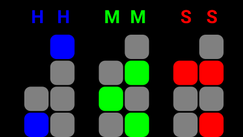

# Android Binary Clock

A simple android binary clock application which supports different screen sizes. 

Each section can be highlighted in seven different colors, and changing the color is as easy as pressing any block in the section.
The labels on top of the sections indicate the hours, minutes and seconds. The labels can be switched on/off by pressing anywhere on the black background.

## This is how it looks like:

